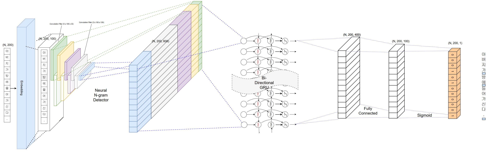

PyKoSpacing 
---------------

Python package for automatic Korean word spacing.

R verson can be found [here](https://github.com/haven-jeon/KoSpacing).

[](http://www.gnu.org/licenses/gpl-3.0)


#### Introduction

Word spacing is one of the important parts of the preprocessing of Korean text analysis. Accurate spacing greatly affects the accuracy of subsequent text analysis. `PyKoSpacing` has fairly accurate automatic word spacing performance,especially good for online text originated from SNS or SMS.

For example.

"아버지가방에들어가신다." can be spaced both of below.


1. "아버지가 방에 들어가신다." means  "My father enters the room."
1. "아버지 가방에 들어가신다." means  "My father goes into the bag."

Common sense, the first is the right answer.

`PyKoSpacing` is based on Deep Learning model trained from large corpus(more than 100 million NEWS articles from [Chan-Yub Park](https://github.com/mrchypark)). 


#### Performance

| Test Set  | Accuracy | 
|---|---|
| Sejong(colloquial style) Corpus(1M) | 97.1% |
| OOOO(literary style)  Corpus(3M)   | 94.3% |

- Accuracy = # correctly spaced characters/# characters in the test data.
  - Might be increased performance if normalize compound words. 


#### Install

##### PyPI Install
Pre-requisite:
```bash
proper installation of python3
proper installation of pip

pip install tensorflow
pip install keras


Windows-Ubuntu case: On following error.
On error: /usr/lib/x86_64-linux-gnu/libstdc++.so.6: version `GLIBCXX_3.4.22' not found
   sudo apt-get install libstdc++6
   sudo add-apt-repository ppa:ubuntu-toolchain-r/test
   sudo apt-get update
   sudo apt-get upgrade
   sudo apt-get dist-upgrade (This takes long time.)
```     
Darwin(m1) case: You should install tensorflow in a different way.(Use [Miniforge3](https://github.com/conda-forge/miniforge))
```bash
# Install Miniforge3 for mac
curl -O https://github.com/conda-forge/miniforge/releases/latest/download/Miniforge3-MacOSX-arm64.sh
chmod +x Miniforge3-MacOSX-arm64.sh
sh Miniforge3-MacOSX-arm64.sh
# Activate Miniforge3 virtualenv
# You should use Python version 3.10 or less.
source ~/miniforge3/bin/activate
# Install the Tensorflow dependencies 
conda install -c apple tensorflow-deps 
# Install base tensorflow 
python -m pip install tensorflow-macos 
# Install metal plugin 
python -m pip install tensorflow-metal
```

To install from GitHub, use

    pip install git+https://github.com/haven-jeon/PyKoSpacing.git


#### Example 

```python
>>> from pykospacing import Spacing
>>> spacing = Spacing()
>>> spacing("김형호영화시장분석가는'1987'의네이버영화정보네티즌10점평에서언급된단어들을지난해12월27일부터올해1월10일까지통계프로그램R과KoNLP패키지로텍스트마이닝하여분석했다.")
"김형호 영화시장 분석가는 '1987'의 네이버 영화 정보 네티즌 10점 평에서 언급된 단어들을 지난해 12월 27일부터 올해 1월 10일까지 통계 프로그램 R과 KoNLP 패키지로 텍스트마이닝하여 분석했다."
>>> # Apply a list of words that must be non-spacing
>>> spacing('귀밑에서턱까지잇따라난수염을구레나룻이라고한다.')
'귀 밑에서 턱까지 잇따라 난 수염을 구레나 룻이라고 한다.'
>>> spacing = Spacing(rules=['구레나룻'])
>>> spacing('귀밑에서턱까지잇따라난수염을구레나룻이라고한다.')
'귀 밑에서 턱까지 잇따라 난 수염을 구레나룻이라고 한다.'
```

Setting rules with csv file. (you only need to use `set_rules_by_csv()` method.)

```bash
$ cat test.csv
인덱스,단어
1,네이버영화
2,언급된단어
```

```python
>>> from pykospacing import Spacing
>>> spacing = Spacing(rules=[''])
>>> spacing.set_rules_by_csv('./test.csv', '단어')
>>> spacing("김형호영화시장분석가는'1987'의네이버영화정보네티즌10점평에서언급된단어들을지난해12월27일부터올해1월10일까지통계프로그램R과KoNLP패키지로텍스트마이닝하여분석했다.")
"김형호 영화시장 분석가는 '1987'의 네이버영화 정보 네티즌 10점 평에서 언급된단어들을 지난해 12월 27일부터 올해 1월 10일까지 통계 프로그램 R과 KoNLP 패키지로 텍스트마이닝하여 분석했다."
```

Run on command line(thanks [lqez](https://github.com/lqez)). 

```bash
$ cat test_in.txt
김형호영화시장분석가는'1987'의네이버영화정보네티즌10점평에서언급된단어들을지난해12월27일부터올해1월10일까지통계프로그램R과KoNLP패키지로텍스트마이닝하여분석했다.
아버지가방에들어가신다.
$ python -m pykospacing.pykos test_in.txt
김형호 영화시장 분석가는 '1987'의 네이버 영화 정보 네티즌 10점 평에서 언급된 단어들을 지난해 12월 27일부터 올해 1월 10일까지 통계 프로그램 R과 KoNLP 패키지로 텍스트마이닝하여 분석했다.
아버지가 방에 들어가신다.
```

Current model [have problems](https://github.com/haven-jeon/PyKoSpacing/issues/52) in some cases when the input includes English characters.<br>
PyKoSpacing provides the parameter `ignore` and `ignore_pattern` to deal with that problem.

- **About `ignore` parameter** (str, optional) <br>
  - `ignore='none'`: No pre/post-processing will be applied. The output will be the same as the model output. <br>
  - `ignore='pre'`: Apply pre-processing which deletes characters that match with `ignore_pattern`. These deleted characters will be merged after model prediction. This option has the problem that it always puts space *after* the deleted characters, since it doesn't know if the deleted character will have a space to the left, right, or both of them. <br>
  - `ignore='post'`: Apply post-processing which ignores model outputs on characters that match with `ignore_pattern`. This option has the problem that English characters in model input can also affect near non-English characters. <br>
  - `ignore='pre2'`: Apply pre-processing which delete characters which matches with `ignore_pattern`, and predict on **both preprocessed text and original text**. This allows it to know where to put space left, right, or both of the deleted characters. However, this option requires to predict **twice**, which doubles the computation time. <br>
  - Default: `ignore='none'`

- **About `ignore_pattern` parameter** (str, optional) <br>
You can input your own regex pattern to `ignore_pattern`. The regex pattern should be the pattern of characters you want to ignore.<br>
  - Default: ``ignore_pattern=r'[^가-힣ㄱ-ㅣ!-@[-`{-~\s]+,*( [^가-힣ㄱ-ㅣ!-@[-`{-~\s]+,*)*[.,!?]* *'``, which matches characters, words, or a sentence of non-Korean and non-ascii symbols.

Examples of `ignore` parameter

```python
>>> from pykospacing import Spacing
>>> spacing = Spacing()
>>> spacing("친구와함께bmw썬바이저를썼다.", ignore='none')
"친구와 함께 bm w 썬바이저를 썼다."
>>> spacing("친구와함께bmw썬바이저를썼다.", ignore='pre')
"친구와 함께bmw 썬바이저를 썼다."
>>> spacing("친구와함께bmw썬바이저를썼다.", ignore='post')
"친구와 함께 bm w 썬바이저를 썼다."
>>> spacing("친구와함께bmw썬바이저를썼다.", ignore='pre2')
"친구와 함께 bmw 썬바이저를 썼다."

>>> spacing("chicken박스를열고닭다리를꺼내입에문다.crispy한튀김옷덕에내입주변은glossy해진다.", ignore='none')
"chicken박스를 열고 닭다리를 꺼내 입에 문다. crispy 한튀김 옷 덕에 내 입 주변은 glossy해진다."
>>> spacing("chicken박스를열고닭다리를꺼내입에문다.crispy한튀김옷덕에내입주변은glossy해진다.", ignore='pre')
"chicken박스를 열고 닭다리를 꺼내 입에 문다.crispy 한 튀김옷 덕에 내 입 주변은glossy 해진다."
>>> spacing("chicken박스를열고닭다리를꺼내입에문다.crispy한튀김옷덕에내입주변은glossy해진다.", ignore='post')
"chicken박스를 열고 닭다리를 꺼내 입에 문다. crispy 한튀김 옷 덕에 내 입 주변은 glossy해진다."
>>> spacing("chicken박스를열고닭다리를꺼내입에문다.crispy한튀김옷덕에내입주변은glossy해진다.", ignore='pre2')
"chicken박스를 열고 닭다리를 꺼내 입에 문다. crispy 한 튀김옷 덕에 내 입 주변은 glossy해진다."

>>> spacing("김형호영화시장분석가는'1987'의네이버영화정보네티즌10점평에서언급된단어들을지난해12월27일부터올해1월10일까지통계프로그램R과KoNLP패키지로텍스트마이닝하여분석했다.", ignore='none')
"김형호 영화시장 분석가는 '1987'의 네이버 영화 정보 네티즌 10점 평에서 언급된 단어들을 지난해 12월 27일부터 올해 1월 10일까지 통계 프로그램 R과 KoNLP 패키지로 텍스트마이닝하여 분석했다."
>>> spacing("김형호영화시장분석가는'1987'의네이버영화정보네티즌10점평에서언급된단어들을지난해12월27일부터올해1월10일까지통계프로그램R과KoNLP패키지로텍스트마이닝하여분석했다.", ignore='pre')
"김형호 영화시장 분석가는 '1987'의 네이버 영화 정보 네티즌 10점 평에서 언급된 단어들을 지난해 12월 27일부터 올해 1월 10일까지 통계 프로그램R과KoNLP 패키지로 텍스트마이닝하여 분석했다."
>>> spacing("김형호영화시장분석가는'1987'의네이버영화정보네티즌10점평에서언급된단어들을지난해12월27일부터올해1월10일까지통계프로그램R과KoNLP패키지로텍스트마이닝하여분석했다.", ignore='post')
"김형호 영화시장 분석가는 '1987'의 네이버 영화 정보 네티즌 10점 평에서 언급된 단어들을 지난해 12월 27일부터 올해 1월 10일까지 통계 프로그램 R과 KoNLP 패키지로 텍스트마이닝하여 분석했다."
>>> spacing("김형호영화시장분석가는'1987'의네이버영화정보네티즌10점평에서언급된단어들을지난해12월27일부터올해1월10일까지통계프로그램R과KoNLP패키지로텍스트마이닝하여분석했다.", ignore='pre2')
"김형호 영화시장 분석가는 '1987'의 네이버 영화 정보 네티즌 10점 평에서 언급된 단어들을 지난해 12월 27일부터 올해 1월 10일까지 통계 프로그램 R과 KoNLP 패키지로 텍스트마이닝하여 분석했다."
```

#### Model Architecture




#### For Training

- Training code uses an architecture that is more advanced than PyKoSpacing, but also contains the learning logic of PyKoSpacing.
  - https://github.com/haven-jeon/Train_KoSpacing

#### Citation

```markdowns
@misc{heewon2018,
author = {Heewon Jeon},
title = {KoSpacing: Automatic Korean word spacing},
publisher = {GitHub},
journal = {GitHub repository},
howpublished = {\url{https://github.com/haven-jeon/KoSpacing}}
```

### Star History

[](https://star-history.com/#haven-jeon/PyKoSpacing&Date)


